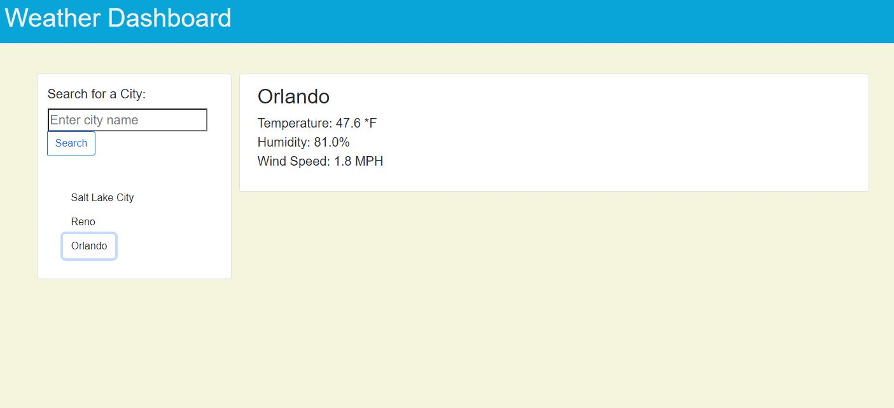

# Weather Dashboard
An easy way to look up local weather.

## Overview
As a busy traveler, the user may not have the time to search for local weather on multiple websites. This app allows the user to see his recent searches' current weather conditions as well as a five-day forecast so he/she can plan accordingly. 

This app uses the [OpenWeather API](https://openweathermap.org/api) to retrieve current weather and five-day forecast data for cities. Forecast data is currently in progress.

## Links

gitHub: (https://github.com/mesgt/Weather_Dashboard)

Published website: (https://mesgt.github.io/Weather_Dashboard/)

## Screenshots:

